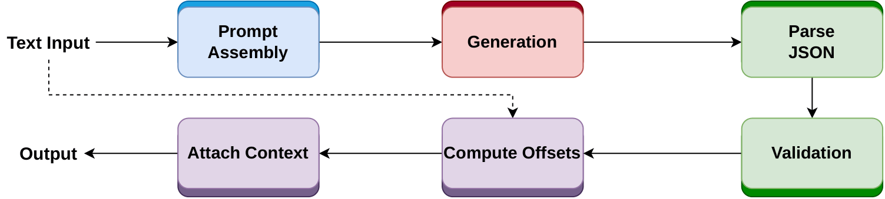
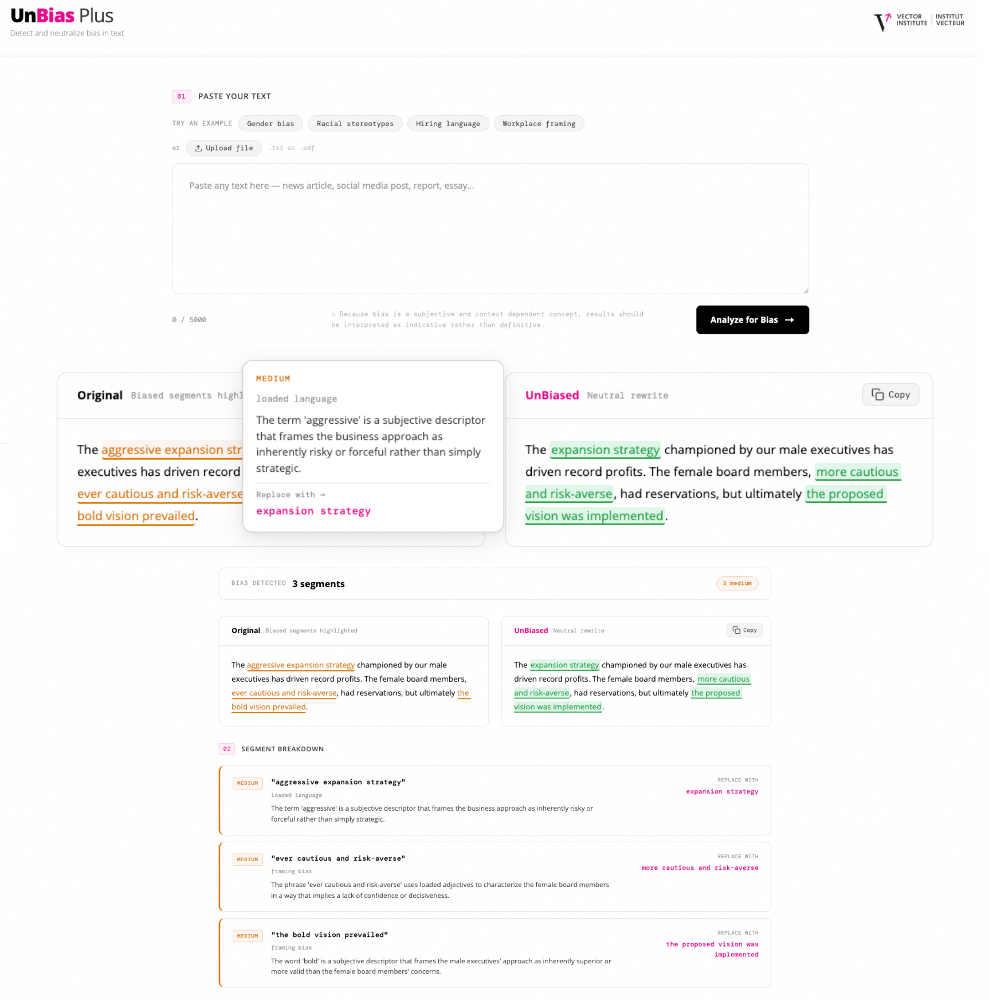

# Summary

Bias in natural language remains a challenge in both human-written and artificial intelligence (AI) generated content, influencing decisions in journalism, hiring, and content moderation. While existing fairness toolkits such as AIF360 [@bellamy2019aif360] and Fairlearn [@weerts2023fairlearn] address algorithmic bias in traditional machine learning (ML) pipelines, and recent large language models (LLMs) - based frameworks such as LangFair [@bouchard2025langfair] target individual fairness tasks, no unified open-source toolkit jointly supports bias classification, segment-level bias typing, and neutral rewriting within a single inference pipeline.

UnBias-Plus addresses this gap through an instruction-tuned LLM trained on a curated, annotated bias dataset with ground-truth labels for classification, bias severity, bias span identification, and neutral rewrites (dataset available at [@unbias-plus-dataset]). The framework supports three core functionalities through a pipeline: (1) multi-label bias classification, (2) named entity–aware detection of biased n-gram spans, and (3) bias mitigation via targeted rewriting at both segment and sentence levels.

The pipeline is integrated as a toolkit exposes a Python API, CLI, and REST interface for developers, and an interactive web interface for non-technical users, supporting reproducible fairness research and practitioner-facing bias review workflows.

# Statement of Need

Bias in LLMs remains a significant challenge. Although modern generative models incorporate guardrails to reduce harmful or unsafe outputs, bias often persists in more implicit and systemic forms. These biases arise from underlying training data distributions and learned associations [@lin2025investigating], making them harder to detect and mitigate.

Several widely used fairness toolkits have emerged in this space. AI Fairness 360 (AIF360) [@bellamy2019aif360] provides a comprehensive suite for detecting disparities and mitigation across preprocessing, in-processing, and post-processing stages. Fairlearn [@weerts2023fairlearn] focuses on practical fairness constraints for ML models, but they are mainly designed for traditional ML settings.

In parallel, a number of open-source tools have been proposed for linguistic bias detection. For instance, Dbias [@raza2022dbias], NBias [@raza2024nbias], and Biaslyze [@biaslyze_api] identify biased expressions in text; however, these approaches largely rely on encoder-only architectures, often operate in an NLTK-style preprocessing pipeline, and do not natively leverage natural language inference or LLMs. More recent frameworks such as LangFair [@bouchard2025langfair] and FairLangPro [@manerba2025fairlangproc] adopt LLM-native, prompt-based strategies, but typically focus on individual tasks such as debiasing or named entity recognition [@vanmassenhove2021neutral].

There is a need for a unified toolkit that can detect and neutralize bias within a pipeline, capable of mitigating bias in both real and AI-generated content. UnBias-Plus provides a more holistic approach to bias analysis in LLMs or GenAI systems.

# Software Design

UnBias-Plus is designed around two guiding principles: *accessibility*, ensuring that practitioners without programming experience can operate the toolkit directly, and *modularity*, enabling extension to new models, tasks, and deployment contexts without modification to the core pipeline. As shown in \autoref{fig:pipeline}, input text flows through prompt construction, LLM inference, structured JSON parsing, character-offset computation, and result assembly.

**Interface.** UnBias-Plus deliberately separates its interfaces by user profile. For developers, the toolkit exposes three programmatic entry points over a shared pipeline implementation: a Python API, a CLI, and a REST API served via FastAPI. The CLI accepts raw text strings or plain-text files, requiring no application code. For non-technical practitioners such as journalists, educators, and content reviewers, invoking `unbias-plus --serve` launches both the `/analyze` REST endpoint and an interactive web interface simultaneously, accessible from any browser without additional configuration as shown in \autoref{fig:ui_demo}. The web interface presents bias severity through color-coded highlighting and provides per-segment reasoning, surfacing the toolkit's output in a form that requires no programming expertise to interpret.





**Model variants and Sustainability.** UnBias-Plus supports training with any instruction-tuned model; however, the default configuration uses Qwen3-8B [@unbias-plus-8b], fine-tuned with low-rank adaptation (LoRA). The design prioritizes accessibility under limited computational resources. For latency-sensitive settings, a compact 4B variant [@unbias-plus-4b] is also provided. Both variants support 4-bit quantization, reducing peak GPU memory usage and enabling deployment on consumer-grade hardware without requiring code changes. Additionally, users can substitute any Hugging Face–compatible checkpoint via a custom model path, allowing domain-specific adaptation without modifying the pipeline.

```python
from unbias_plus import UnBiasPlus

pipe   = UnBiasPlus()
result = pipe.analyze("Women are too emotional to lead.")

print(result.binary_label)       # "biased"
print(result.severity)           # 4

seg = result.biased_segments[0]
print(seg.original)              # "too emotional"
print(seg.bias_type)             # "loaded language"
print(seg.replacement)           # "capable of thoughtful decision-making"
print(seg.start, seg.end)        # 11  24

print(result.unbiased_text)
# "Women are capable of thoughtful decision-making in leadership."
```

**Segment-level analysis.** In addition to producing only a document-level binary verdict, UnBias-Plus also performs bias analysis at the segment level. Each detected span is assigned an independent bias type label (e.g., *loaded language*, *framing bias*, *stereotyping*), a severity score, and a neutral replacement. This granularity enables practitioners to understand which expressions are reflecting bias and why. As demonstrated in the code listing above, both the segment-level breakdown and the document-level rewrite are returned in a single inference call.

**Structured output and character offsets.** Each segment detected by UnBias-Plus is returned with its character-level start and end offsets into the original input string. Rather than delegating span localisation to a secondary model, such as a BERT-based sequence tagger, UnBias-Plus computes offsets deterministically after JSON parsing via a cursor-based string search over the original text. This approach anchors each replacement precisely to its source position regardless of the tokenization scheme used during inference, and enables one-to-one alignment between original and replaced spans in downstream rendering without additional string-search operations.

# Research Impact Statement

The research impact of UnBias-Plus is multi-faceted across research, industry, and societal dimensions. From a research perspective, it contributes a unified framework for bias detection, classification, named entity recognition, and debiasing, along with associated code and datasets that can support reproducible development of fairness-aware language systems.

In industry, UnBias-Plus can be applied across domains such as journalism, content moderation, and recommender systems. For example, news and editorial teams can use it to screen biased or non-neutral language, reducing manual review time from 20–30 minutes per document to only a few seconds. Similarly, in high-stakes domains such as hiring, insurance, and customer decision systems, it can help flag potentially biased language or decisions, supporting fairer and more transparent workflows.

At the societal level, such tools can promote more equitable information dissemination and decision-making by reducing the propagation of biased language in public-facing systems. It can also support educational settings, where students can use it to identify and refine biased expressions in essays, fostering awareness of fairness in communication.

# Focused Use Cases

UnBias-Plus targets practitioners across several domains. Editorial teams can review drafts before publication: the toolkit highlights biased phrases, explains each issue, and suggests neutral rewrites, reducing the time required for manual bias review at scale. HR and policy teams can apply the same pipeline to job postings and internal documents before wider distribution. NLP and fairness researchers can also utilize the toolkit for dataset construction and benchmarking. Developers can integrate bias detection directly into existing pipelines using the same interface.

# AI usage disclosure

ChatGPT was used for grammar and readability improvements in the paper text, and for AI-assisted code suggestions during development. All outputs were reviewed, edited, and validated by the human authors, who made all core design and architectural decisions.

# Acknowledgements

Resources used in preparing this research were provided, in part, by the Province of Ontario, the Government of Canada through CIFAR, and companies sponsoring the Vector Institute (http://www.vectorinstitute.ai/#partners). This research was funded by the European Union's Horizon Europe research and innovation programme under the AIXPERT project (Grant Agreement No. 101214389), which aims to develop an agentic, multi-layered, GenAI-powered framework for creating explainable, accountable, and transparent AI systems.

# References